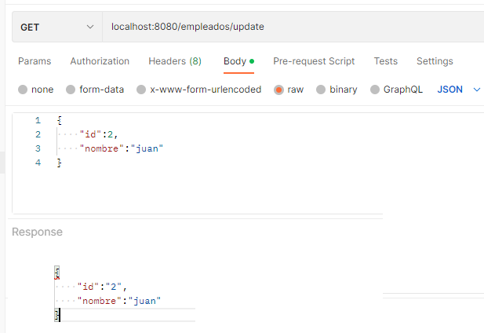
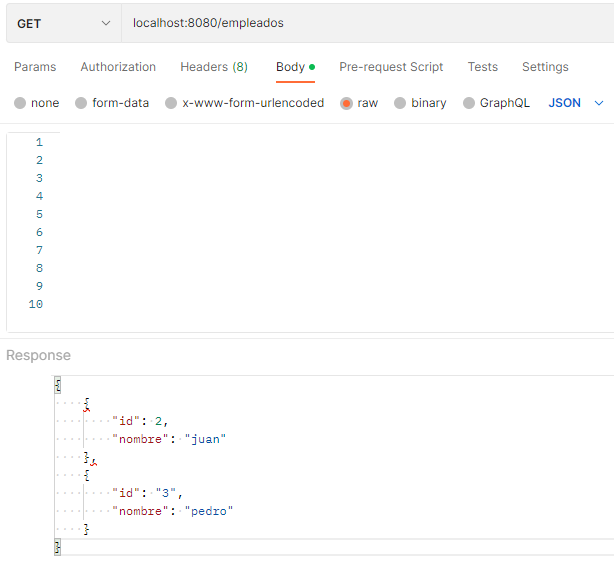

# Postwork 07: Microservicios

## 🎩 Objetivo

- Realizar microservicios a un servidor de MongoDB, para almacenar y consultar registros alojados en la base de datos.
- A lo largo de este proyecto reafirmaremos lo que se ha aprendido durante las sesiones.

## 🚀 Desarrollo

- Crear empleado

   

- Consultar empleados
    
   

- Consultar empleado por id
    
   

- Registros desde MongoDB Atlas

   

 
 

[Regresar ](../Readme.md)(Sesión 07)

[Siguiente ](../../Sesion-08/Readme.md)(Sesión 08)
